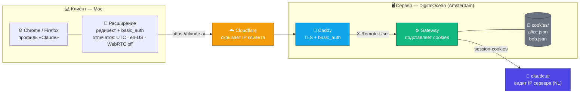
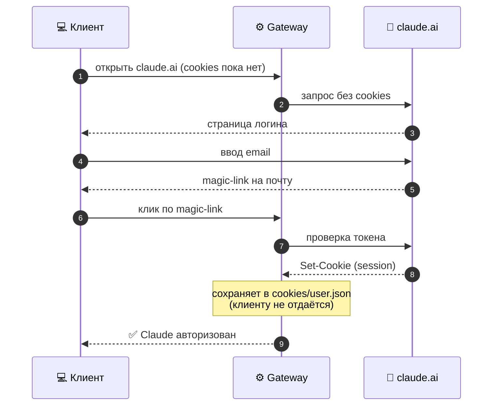

# claude_for_browes

Доступ к оригинальному веб-интерфейсу Claude.ai через собственный шлюз. Шлюз хранит session-cookies Claude на сервере и подставляет их в проксируемые запросы, поэтому браузер клиента рендерит Claude **нативно** — без видео-стриминга удалённого рабочего стола, без задержки ввода, с нормальным русским вводом, буфером обмена и drag-and-drop файлов.

Claude видит **IP сервера**, а не клиента. Полезно, когда claude.ai гео-заблокирован или вы не хотите держать cookies Claude на машине клиента.

## Как это работает



**Что видит каждая сторона:**

| Сторона | Видит |
|---|---|
| Провайдер клиента | только соединение с Cloudflare |
| Cloudflare | реальный IP клиента |
| **claude.ai** | **только IP сервера (Amsterdam, NL)** + session-cookies |

### Первый вход пользователя (self-service, без удалённого браузера)



**Компоненты:**

- **Gateway** (`gateway/gateway.js`) — Node.js прокси без зависимостей (≈300 строк, читается за 10 минут). Подставляет cookies в запросы **только к `claude.ai`**, переписывает URL ассетов и CSP-заголовки (чтобы SPA работала через прокси), вырезает все заголовки, раскрывающие клиента (`CF-Connecting-IP`, `X-Forwarded-For`, `Forwarded`, `Via`, …) и basic_auth-заголовок, не отдаёт браузеру `Set-Cookie` и не пишет в логи query-строки и cookies.
- **Caddy** — TLS + basic_auth + маршрутизация. Пути ассетов отдаются без basic_auth (публичные JS/CSS), чтобы не было 401 при динамическом `import()`.
- **Расширение браузера** (`extension/`, **Chrome/Edge и Firefox**) — прозрачно редиректит `claude.ai` и его ассет-домены на шлюз, добавляет basic_auth-заголовок и **нормализует отпечаток** страницы: часовой пояс → UTC, язык → en-US, геолокация запрещена, WebRTC отключён.

## Структура репозитория

| Путь | Что это |
|---|---|
| `gateway/gateway.js` | прокси с подстановкой cookies (Node, без зависимостей) |
| `server/compose.yaml` | docker-compose: gateway + caddy (с жёсткой изоляцией контейнеров) |
| `server/Caddyfile.template` | шаблон конфига Caddy (multi-user basic_auth) |
| `server/add-user.sh`, `remove-user.sh` | добавить/сменить пароль/удалить пользователя |
| `server/backup.sh`, `restore.sh` | зашифрованный бэкап и восстановление |
| `extension/` | расширение Chrome/Edge и Firefox (Manifest V3), `build.sh` собирает оба пакета |
| `tests/` | тесты шлюза (`node --test`) и проверка отпечатка в реальном Chrome |
| `SECURITY.md` | модель угроз, что проверено, ограничения |
| `install.sh` | **поэтапный интерактивный установщик сервера** (рекомендуется) |
| `configure.sh` | подставляет ваш домен в шаблоны |
| `docs/DEPLOY-SERVER.md` | подробная настройка сервера |
| `docs/SETUP-CLIENT.md` | подробная настройка клиента (Mac) |
| `docs/MULTI-USER.md` | несколько пользователей + расчёт ёмкости |

---

# Установка

## Быстрый старт (рекомендуется)

На сервере (Ubuntu/Debian, root):

```sh
git clone <этот-репозиторий> && cd claude_for_browes
bash install.sh
```

Интерактивный установщик проведёт по 9 шагам: проверка окружения → домен → первый пользователь (bcrypt) → генерация конфигов, ключей и `.env` (+ Telegram по желанию) → сборка каталога и расширений → резервные копии (ключ + cron) → проверка DNS → запуск → проверка.

После установки готовые расширения под ваш домен раздаются самим сервером: **`https://<домен>/__ext/`** (за логином/паролем) — отправляйте клиенту эту ссылку, логин и пароль. Руками ничего собирать не нужно.

Другие возможности сервера:
- **Статус** — в попапе расширения («Claude session OK / expired / не выполнен вход»); сводка по всем: `curl -u admin https://<домен>/__admin/status`.
- **Telegram-алерты** — истёкшая сессия пользователя и бан IP (`TELEGRAM_BOT_TOKEN`, `TELEGRAM_CHAT_ID` в `.env`).
- **Защита от подбора пароля**, **шифрование cookies на диске**, **ежедневный бэкап**, **WebSocket**, **сжатие** и **кэш статики** — см. [SECURITY.md](SECURITY.md).

Рекомендация по масштабу: **один сервер (один IP) на одного клиента/группу** — так аккаунты разных клиентов не смешиваются под одним IP.

Дальше — «Часть 2. Клиент».

Ниже — ручная установка по шагам (если не используете `install.sh`).

## Часть 1. Сервер

Нужен сервер с публичным IP в регионе, где доступен claude.ai (например DigitalOcean, Amsterdam). Тестировано на Ubuntu + Docker, 1 vCPU / 2GB RAM.

### Шаг 1. Установите Docker

```sh
curl -fsSL https://get.docker.com | sh
```

### Шаг 2. Склонируйте репозиторий на сервер

```sh
git clone git@github.com:JFT-git/claude_for_browes.git /root/claude-browser
cd /root/claude-browser
```

### Шаг 3. Подставьте ваш домен

```sh
./configure.sh claude.example.com
```

Это заполнит домен в `extension/` и создаст `server/Caddyfile` из шаблона.

### Шаг 4. Задайте basic_auth

Отредактируйте `server/Caddyfile` — замените плейсхолдеры:
- `__BASIC_AUTH_USER__` — имя пользователя (например `owner`)
- `__BASIC_AUTH_HASH__` — хэш пароля. Сгенерируйте:

```sh
docker run --rm caddy:2 caddy hash-password --plaintext 'ваш-пароль'
```

Вставьте результат вместо `__BASIC_AUTH_HASH__`.

### Шаг 5. Разложите файлы по местам

На сервере должна получиться такая структура:

```
/root/claude-browser/
├── compose.yaml              ← из server/compose.yaml
├── Caddyfile                 ← сгенерирован и отредактирован (шаг 3-4)
└── gateway/
    ├── src/gateway.js        ← из gateway/gateway.js
    └── cookies/              ← сюда попадут session-cookies (по файлу на пользователя)
```

```sh
cp server/compose.yaml ./compose.yaml
mkdir -p gateway/src gateway/cookies
cp gateway/gateway.js gateway/src/gateway.js
```

### Шаг 6. DNS / Cloudflare

Направьте `claude.example.com` на IP сервера.

**Рекомендуется Cloudflare** (скрывает origin и сглаживает обрывы соединения на уровне провайдера):
1. Добавьте запись A: `claude` → IP сервера
2. Включите **Proxied** (оранжевое облако)
3. SSL/TLS → режим **Full**

### Шаг 7. Запустите

```sh
cd /root/claude-browser
docker compose up -d
```

Поднимутся два контейнера: `gateway` и `caddy`.

### Шаг 8. Добавьте пользователей

```sh
./add-user.sh alice            # пароль сгенерируется и покажется один раз
./add-user.sh alice 'свой-пароль-12+'  # или задайте свой / смените существующий
./remove-user.sh alice
```

Пользователь логинится в Claude **сам**, через шлюз (magic-link), — шлюз перехватывает его session-cookies в `gateway/cookies/<user>.json` и никогда не отдаёт их браузеру. Удалённый браузер не нужен.

### Шаг 9. Проверьте

```sh
curl -s -u owner:ваш-пароль https://claude.example.com/__health
# → {"ok":true,"users":0}
```

---

## Часть 2. Клиент (Mac)

Настройка на машине каждого клиента. ~5 минут.

### Что выдать клиенту

- Папку `extension/dist/chrome` (Chrome/Edge) или `extension/dist/firefox` (Firefox) — собирается командой `./configure.sh <домен>` (уже настроено под ваш домен)
- Gateway host (например `claude.example.com`)
- Его basic_auth **user** и **password**

### Шаг 1. Создайте отдельный профиль браузера

1. Chrome → значок профиля (правый верх) → **Добавить**
2. Назовите, например, «Claude»
3. **Не** входите в Google-аккаунт в этом профиле

### Готовые сборки (без компиляции)

В папке [`releases/`](releases/) лежат готовые пакеты расширения для Chrome и Firefox (+ `SHA256SUMS`). Они **не привязаны к домену** — превратите их в рабочую папку под ваш шлюз одной командой:

```sh
./releases/configure-prebuilt.sh chrome  claude.example.com   # -> releases/claude-gateway-chrome/
./releases/configure-prebuilt.sh firefox claude.example.com   # -> releases/claude-gateway-firefox/
```

Это то же самое, что собрать из исходников (`./configure.sh`), — содержимое можно сверить с `extension/` и контрольными суммами. Пересобрать релиз: `extension/release.sh` на чистой копии репозитория.

### Шаг 2. Установите расширение

**Chrome / Edge:** `chrome://extensions` → **Режим разработчика** → **Загрузить распакованное** → папка `extension/dist/chrome`.

**Firefox (≥ 128):** `about:debugging#/runtime/this-firefox` → **Load Temporary Add-on…** → `extension/dist/firefox/manifest.json`. Временное дополнение снимается при перезапуске Firefox; для постоянной установки подпишите пакет `extension/dist/claude-gateway-firefox.zip` на [addons.mozilla.org](https://addons.mozilla.org/developers/) (unlisted) — или используйте Firefox Developer/Nightly с `xpinstall.signatures.required=false`.

Откройте **Settings** расширения и введите:
- **Gateway host:** например `claude.example.com`
- **User / Password:** basic_auth-креды клиента

### Шаг 3. Чистый отпечаток — делает расширение

На странице Claude расширение автоматически подставляет:

| Что | Значение |
|---|---|
| Часовой пояс (`Date`, `Intl`, `toLocale*`) | **UTC** |
| Язык (`navigator.language(s)`, `Intl`-локаль, `Accept-Language`) | **en-US** |
| Геолокация | запрещена |
| WebRTC (`RTCPeerConnection`) | отключён — не утечёт локальный/реальный IP |

Ограничения (честно): не покрываются Web/Service Workers; расширение не скрывает ваш IP (это делает шлюз) и не меняет железные признаки (экран, шрифты, GPU). Подробнее — [SECURITY.md](SECURITY.md).

### Шаг 4. Пользуйтесь Claude

Откройте `https://claude.ai` в этом профиле. Он загрузится через шлюз с уже авторизованной сессией.

- Печатайте по-русски, вставляйте текст/ссылки, перетаскивайте файлы — всё нативно, без лагов
- Claude видит IP сервера, не ваш

---

# Диагностика проблем

| Симптом | Решение |
|---|---|
| Зацикленное окно логина браузера | Заново введите креды в Options расширения, затем обновите расширение (⟳ на `chrome://extensions`) |
| Claude просит логин | Сессия протухла — просто залогиньтесь снова через шлюз (magic-link), cookies перехватятся автоматически |
| Шрифты сломаны | Hard reload: ⌘+Shift+R |
| Страница частично грузится / таймауты | Сеть клиента обрывает соединение — попробуйте другую сеть или убедитесь, что настроен Cloudflare (Часть 1, шаг 6) |
| 401 на `/v1/code/*` или ассетах | Убедитесь, что gateway обновлён (удаляет `authorization` перед форвардингом) |

---

# Обновление cookies (когда сессия истечёт)

Когда Claude снова покажет логин — пользователь входит заново через шлюз, cookies перехватываются автоматически. Ничего делать на сервере не нужно.

---

# Несколько клиентов (multi-client)

Шлюз **из коробки** обслуживает много пользователей, у каждого свой Claude-аккаунт и свои cookies:

- cookies хранятся по пользователям (`gateway/cookies/<user>.json`)
- на каждого клиента — свой basic_auth-пользователь в Caddy
- gateway выбирает cookie-файл по авторизованному basic_auth-пользователю (заголовок `X-Remote-User`)
- пользователь логинится сам через шлюз (magic-link) — шлюз перехватывает его cookies

Добавить пользователя: `./server/add-user.sh <имя> <пароль>`

**Подробно + расчёт ёмкости сервера: [docs/MULTI-USER.md](docs/MULTI-USER.md)**

---

# Безопасность

Весь код открыт — проверьте сами: `gateway/gateway.js` (прокси), `extension/` (расширение), `server/` (Caddy + docker). Подробный разбор — **[SECURITY.md](SECURITY.md)**. Коротко:

- Session-cookies живут только на сервере (`gateway/cookies/*.json`, права 600, в `.gitignore`) и уходят только на `claude.ai`.
- Шлюз вырезает заголовки, раскрывающие клиента, и не логирует cookies, query-строки и тела запросов.
- Контейнеры: `cap_drop: ALL`, `no-new-privileges`, read-only FS у шлюза, порты наружу — только 80/443 у Caddy.
- Тесты: `npm test` (шлюз), `npm run test:fingerprint` (реальный Chrome с TZ=Europe/Moscow), CI на GitHub.

---

# Лицензия

MIT — см. [LICENSE](LICENSE).
