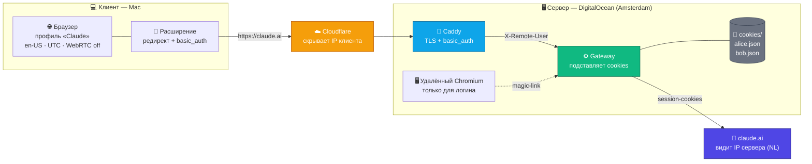
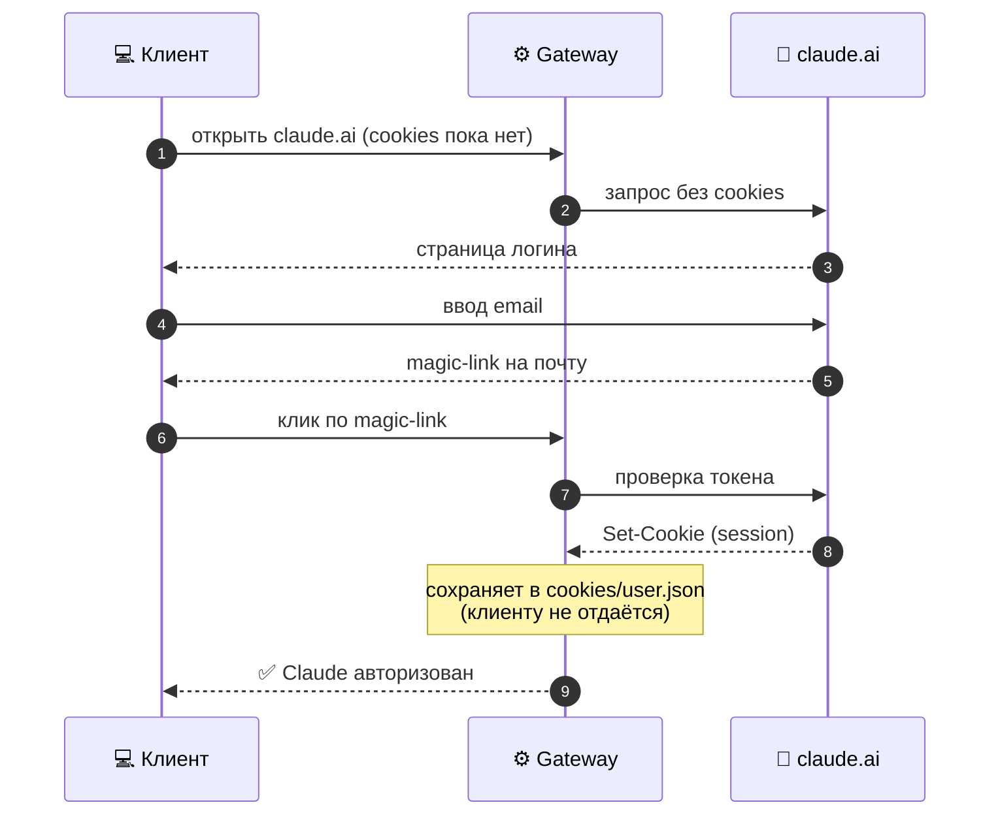

# claude_for_browes

Доступ к оригинальному веб-интерфейсу Claude.ai через собственный шлюз. Шлюз хранит session-cookies Claude на сервере и подставляет их в проксируемые запросы, поэтому браузер клиента рендерит Claude **нативно** — без видео-стриминга удалённого рабочего стола, без задержки ввода, с нормальным русским вводом, буфером обмена и drag-and-drop файлов.

Claude видит **IP сервера**, а не клиента. Полезно, когда claude.ai гео-заблокирован или вы не хотите держать cookies Claude на машине клиента.

## Как это работает



**Что видит каждая сторона:**

| Сторона | Видит |
|---|---|
| Провайдер клиента | только соединение с Cloudflare |
| Cloudflare | реальный IP клиента |
| **claude.ai** | **только IP сервера (Amsterdam, NL)** + session-cookies |

### Первый вход пользователя (self-service, без удалённого браузера)



**Компоненты:**

- **Gateway** (`gateway/gateway.js`) — Node.js прокси без зависимостей. Подставляет cookies в запросы к `claude.ai`, переписывает URL ассетов и CSP-заголовки (чтобы SPA работала через прокси), удаляет basic_auth-заголовок перед форвардингом (Claude отклоняет запросы, где есть и auth-заголовок, и session-cookie одновременно).
- **Caddy** — TLS + basic_auth + маршрутизация. Пути ассетов отдаются без basic_auth (публичные JS/CSS), чтобы не было 401 при динамическом `import()`.
- **Расширение браузера** (`extension/`) — прозрачно редиректит `claude.ai` и его ассет-домены на шлюз и добавляет basic_auth-заголовок.
- **Удалённый Chromium** (опционально, linuxserver/chromium) — нужен только чтобы один раз залогиниться по magic-link и извлечь session-cookies.

## Структура репозитория

| Путь | Что это |
|---|---|
| `gateway/gateway.js` | прокси с подстановкой cookies (Node, без зависимостей) |
| `server/compose.yaml` | docker-compose: browser + gateway + caddy |
| `server/Caddyfile.template` | шаблон конфига Caddy (multi-user basic_auth) |
| `server/add-user.sh` | добавить пользователя (basic_auth + cookie-слот) |
| `server/extract_cookies.py` | извлечение session-cookies из удалённого Chromium через CDP |
| `extension/` | расширение Chrome/Edge (Manifest V3) |
| `configure.sh` | подставляет ваш домен в шаблоны |
| `docs/DEPLOY-SERVER.md` | подробная настройка сервера |
| `docs/SETUP-CLIENT.md` | подробная настройка клиента (Mac) |
| `docs/MULTI-USER.md` | несколько пользователей + расчёт ёмкости |

---

# Установка

## Часть 1. Сервер

Нужен сервер с публичным IP в регионе, где доступен claude.ai (например DigitalOcean, Amsterdam). Тестировано на Ubuntu + Docker, 1 vCPU / 2GB RAM.

### Шаг 1. Установите Docker

```sh
curl -fsSL https://get.docker.com | sh
```

### Шаг 2. Склонируйте репозиторий на сервер

```sh
git clone git@github.com:JFT-git/claude_for_browes.git /root/claude-browser
cd /root/claude-browser
```

### Шаг 3. Подставьте ваш домен

```sh
./configure.sh claude.example.com
```

Это заполнит домен в `extension/` и создаст `server/Caddyfile` из шаблона.

### Шаг 4. Задайте basic_auth

Отредактируйте `server/Caddyfile` — замените плейсхолдеры:
- `__BASIC_AUTH_USER__` — имя пользователя (например `owner`)
- `__BASIC_AUTH_HASH__` — хэш пароля. Сгенерируйте:

```sh
docker run --rm caddy:2 caddy hash-password --plaintext 'ваш-пароль'
```

Вставьте результат вместо `__BASIC_AUTH_HASH__`.

### Шаг 5. Разложите файлы по местам

На сервере должна получиться такая структура:

```
/root/claude-browser/
├── compose.yaml              ← из server/compose.yaml
├── Caddyfile                 ← сгенерирован и отредактирован (шаг 3-4)
├── gateway/
│   ├── src/gateway.js        ← из gateway/gateway.js
│   └── cookies/              ← сюда попадут session-cookies
└── extract_cookies.py        ← из server/extract_cookies.py
```

```sh
cp server/compose.yaml ./compose.yaml
mkdir -p gateway/src gateway/cookies
cp gateway/gateway.js gateway/src/gateway.js
cp server/extract_cookies.py ./extract_cookies.py
```

### Шаг 6. DNS / Cloudflare

Направьте `claude.example.com` на IP сервера.

**Рекомендуется Cloudflare** (скрывает origin и сглаживает обрывы соединения на уровне провайдера):
1. Добавьте запись A: `claude` → IP сервера
2. Включите **Proxied** (оранжевое облако)
3. SSL/TLS → режим **Full**

### Шаг 7. Запустите

```sh
cd /root/claude-browser
docker compose up -d
```

Поднимутся три контейнера: `browser` (удалённый Chromium), `gateway`, `caddy`.

### Шаг 8. Залогиньтесь в Claude и извлеките cookies

Шлюзу нужны валидные session-cookies Claude. Проще всего — через встроенный удалённый Chromium:

1. Откройте `https://claude.example.com/desktop/` (введите basic_auth) — это удалённый браузер
2. Залогиньтесь в claude.ai по magic-link
3. На сервере извлеките cookies в хранилище шлюза:

```sh
docker exec claude-browser-browser-1 /lsiopy/bin/pip3 install --quiet websocket-client
docker cp extract_cookies.py claude-browser-browser-1:/tmp/extract_cookies.py
docker exec claude-browser-browser-1 /lsiopy/bin/python3 /tmp/extract_cookies.py
```

Скрипт выводит только сводку (количество/домены) — никогда не значения cookies.

4. Шлюз подхватит cookies автоматически в течение ~15 секунд.

### Шаг 9. Проверьте

```sh
curl -u owner:ваш-пароль https://claude.example.com/api/bootstrap
# → 200 и JSON с данными аккаунта
```

Если 200 — сервер готов.

---

## Часть 2. Клиент (Mac)

Настройка на машине каждого клиента. ~5 минут.

### Что выдать клиенту

- Папку `extension/` (уже настроенную через `configure.sh`)
- Gateway host (например `claude.example.com`)
- Его basic_auth **user** и **password**

### Шаг 1. Создайте отдельный профиль браузера

1. Chrome → значок профиля (правый верх) → **Добавить**
2. Назовите, например, «Claude»
3. **Не** входите в Google-аккаунт в этом профиле

### Шаг 2. Чистый отпечаток (чтобы Claude не видел реальный регион)

В этом профиле:

1. **Язык:** `chrome://settings/languages` → переместите **English (United States)** наверх
2. **Часовой пояс UTC:** установите расширение смены часового пояса (например «Change Timezone») и выставьте **UTC**
3. **WebRTC off:** `chrome://flags/#disable-webrtc` → Enabled (или расширение WebRTC Control)
4. **Геолокация off:** `chrome://settings/content/location` → не разрешать

### Шаг 3. Установите расширение

1. Откройте `chrome://extensions`
2. Включите **Режим разработчика** (правый верх)
3. **Загрузить распакованное расширение** → выберите папку `extension/`
4. Откройте **Options** расширения (Details → Extension options)
5. Введите:
   - **Gateway host:** например `claude.example.com`
   - **User / Password:** basic_auth-креды клиента
6. **Save**

### Шаг 4. Пользуйтесь Claude

Откройте `https://claude.ai` в этом профиле. Он загрузится через шлюз с уже авторизованной сессией.

- Печатайте по-русски, вставляйте текст/ссылки, перетаскивайте файлы — всё нативно, без лагов
- Claude видит IP сервера, не ваш

---

# Диагностика проблем

| Симптом | Решение |
|---|---|
| Зацикленное окно логина браузера | Заново введите креды в Options расширения, затем обновите расширение (⟳ на `chrome://extensions`) |
| Claude просит логин | Cookies протухли — переизвлеките (Часть 1, шаг 8) |
| Шрифты сломаны | Hard reload: ⌘+Shift+R |
| Страница частично грузится / таймауты | Сеть клиента обрывает соединение — попробуйте другую сеть или убедитесь, что настроен Cloudflare (Часть 1, шаг 6) |
| 401 на `/v1/code/*` или ассетах | Убедитесь, что gateway обновлён (удаляет `authorization` перед форвардингом) |

---

# Обновление cookies (когда сессия истечёт)

Когда Claude начнёт возвращать 401 (сессия протухла), повторите Часть 1, шаг 8 (логин в удалённом браузере + извлечение cookies). Шлюз подхватит новые cookies сам за ~15 секунд.

---

# Несколько клиентов (multi-client)

Шлюз **из коробки** обслуживает много пользователей, у каждого свой Claude-аккаунт и свои cookies:

- cookies хранятся по пользователям (`gateway/cookies/<user>.json`)
- на каждого клиента — свой basic_auth-пользователь в Caddy
- gateway выбирает cookie-файл по авторизованному basic_auth-пользователю (заголовок `X-Remote-User`)
- пользователь логинится сам через шлюз (magic-link) — шлюз перехватывает его cookies

Добавить пользователя: `./server/add-user.sh <имя> <пароль>`

**Подробно + расчёт ёмкости сервера: [docs/MULTI-USER.md](docs/MULTI-USER.md)**

---

# Безопасность

- Session-cookies хранятся только на сервере (`gateway/cookies/`, в .gitignore). Никогда не коммитьте их.
- Хэш basic_auth задаётся в `server/Caddyfile` (генерируется, в .gitignore), а не в шаблоне.
- Gateway удаляет `Authorization`/`Proxy-Authorization` перед форвардингом и не логирует значения cookies.
- Держите профиль клиента на English (US) + UTC с выключенным WebRTC для чистого отпечатка.
